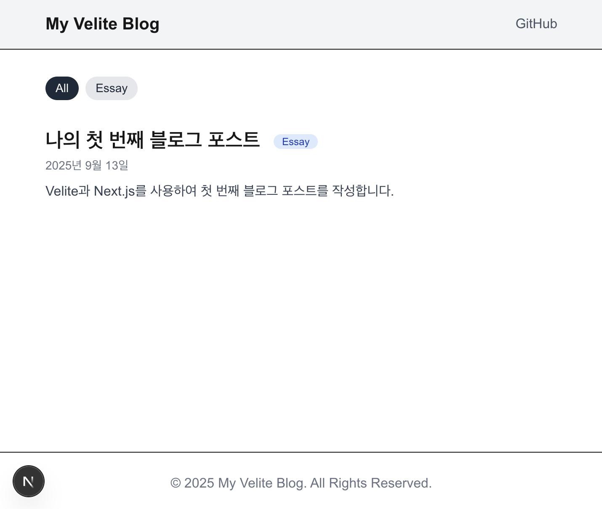

# Next.js + Velite 기반 정적 블로그 템플릿

🚀 빠르고 현대적인 기술 스택으로 구성된 정적 블로그 템플릿입니다. Velite을 사용하여 Markdown 기반의 콘텐츠를 타입-안전하게 관리하고, Next.js 15의 App Router를 통해 최적화된 정적 사이트를 생성합니다.


[Demo Page](https://jinh0park.github.io/velite-blog-demo)

## ✨ 주요 기능

  - **정적 사이트 생성 (SSG):** `output: 'export'` 설정을 통해 GitHub Pages와 같은 모든 정적 호스팅 서비스에 배포할 수 있습니다.
  - **콘텐츠 관리 with Velite:** `content/posts` 폴더에 Markdown 파일을 추가/수정하는 것만으로 쉽게 콘텐츠를 관리할 수 있습니다.
  - **동적 라우팅:** 게시물 상세 페이지(`/blog/[slug]`)와 카테고리별 목록 페이지(`/categories/[category]`)가 자동으로 생성됩니다.
  - **스타일링:** Tailwind CSS v4와 Typography 플러그인이 설정되어 있어, 마크다운 콘텐츠가 아름답게 스타일링됩니다.
  - **코드 하이라이팅:** `rehype-pretty-code` (Shiki 기반)를 통해 코드 블록에 미려한 구문 강조를 적용합니다.
  - **SEO 최적화:** `generateMetadata`를 사용하여 각 페이지에 맞는 동적 메타데이터(제목, 설명)가 자동으로 생성됩니다.
  - **이미지 처리:** Markdown 내 상대 경로 이미지를 자동으로 처리하여 배포 경로에 맞게 최적화합니다.
  - **배포 준비 완료:** GitHub Pages 배포를 위한 모든 설정(`basePath`, `assetPrefix`, `.nojekyll`)이 완료되어 있습니다.

## 🛠️ 기술 스택

  - **Framework:** Next.js 15 (App Router)
  - **Content:** Velite
  - **Styling:** Tailwind CSS v4
  - **Language:** TypeScript

## 🚀 시작하기

### 1\. 템플릿 복제 및 의존성 설치

```bash
# 템플릿을 복제합니다.
git clone https://github.com/jinh0park/velite-blog-demo.git

# 프로젝트 폴더로 이동합니다.
cd velite-blog-demo

# 의존성 패키지를 설치합니다.
npm install
```

### 2\. 프로젝트 설정 수정하기

템플릿을 자신의 블로그로 만들기 위해 몇 가지 파일을 수정해야 합니다.

#### A. `next.config.ts`

GitHub Pages 배포를 위해 `basePath`와 `assetPrefix`를 자신의 저장소 이름으로 변경해야 합니다.

```typescript
// next.config.ts
const repositoryName = 'velite-blog-demo'; // 👈 이 부분을 자신의 GitHub 저장소 이름으로 변경하세요.

const nextConfig: NextConfig = {
  // ...
  basePath: isProd ? `/${repositoryName}` : '',
  assetPrefix: isProd ? `/${repositoryName}/` : '',
  // ...
};
```

#### B. `velite.config.ts`

블로그에서 사용할 카테고리 목록을 수정합니다.

```typescript
// velite.config.ts
const repositoryName = 'velite-blog-demo'; // 👈 이 부분도 자신의 GitHub 저장소 이름으로 변경하세요.
// ...
const posts = defineCollection({
  // ...
  schema: s.object({
    // ...
    category: s.enum(['Dev', 'Essay', 'Info']), // 👈 이 배열을 원하는 카테고리로 수정하세요.
    // ...
  })
});
```

#### C. `package.json`

프로젝트의 이름, 버전, 설명 등을 수정합니다.

```json
{
  "name": "my-awesome-blog",
  "version": "1.0.0",
  "description": "My awesome new blog.",
  // ...
}
```

#### D. 기타 정보 수정

  - **블로그 제목:** `src/components/Header.tsx` 파일에서 블로그 제목과 GitHub 링크를 수정하세요.
  - **푸터 정보:** `src/components/Footer.tsx` 파일에서 저작권 정보를 수정하세요.
  - **SEO 기본값:** `src/app/layout.tsx` 파일에서 `metadata`의 기본 제목과 설명을 수정하세요.

### 3\. 콘텐츠 작성하기

`content/posts` 폴더에 있는 예제 `.md` 파일을 수정하거나, 새로운 Markdown 파일을 추가하여 글을 작성할 수 있습니다. 파일 상단의 Frontmatter는 `velite.config.ts`에 정의된 스키마와 일치해야 합니다.

### 4\. 로컬에서 개발 서버 실행하기

```bash
npm run dev
```

브라우저에서 `http://localhost:3000` 주소로 접속하여 블로그를 확인하세요.

## 🚢 배포하기

이 템플릿은 GitHub Pages 배포에 최적화되어 있습니다.

### 1\. GitHub 저장소 생성 및 코드 푸시

  - GitHub에 새로운 저장소를 생성합니다.
  - 로컬 프로젝트를 해당 저장소에 푸시합니다.

### 2\. 배포 스크립트 실행

아래 명령어를 순서대로 실행하면 빌드부터 배포까지 자동으로 진행됩니다.

```bash
# 1. 정적 파일로 프로젝트를 빌드합니다. (out 폴더 생성)
npm run build

# 2. 빌드된 out 폴더의 내용을 gh-pages 브랜치로 배포합니다.
npm run deploy
```

### 3\. GitHub Pages 설정

  - GitHub 저장소의 **Settings \> Pages** 메뉴로 이동합니다.
  - **Source**를 \*\*"Deploy from a branch"\*\*로 설정합니다.
  - **Branch**를 **`gh-pages`** / **`/ (root)`** 로 설정하고 저장합니다.

잠시 후 `https://<your-username>.github.io/<your-repository-name>/` 주소에서 블로그를 확인할 수 있습니다.

## 📜 라이선스

이 프로젝트는 [MIT License](https://www.google.com/search?q=LICENSE)를 따릅니다.
